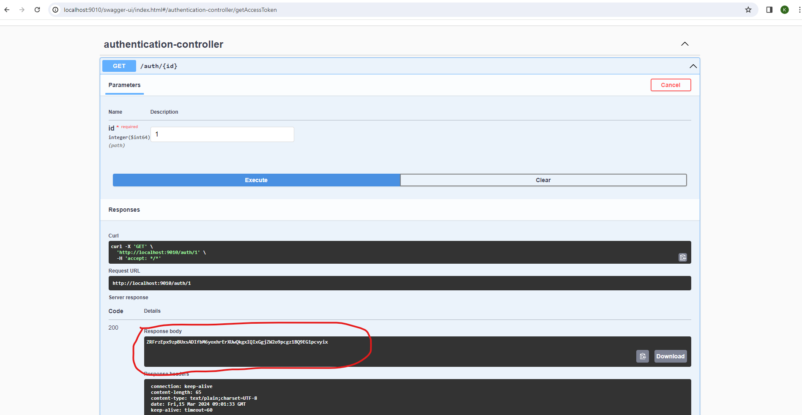
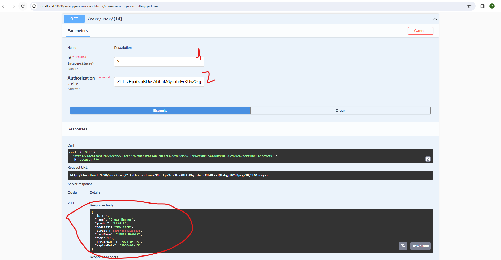

# Setup

* git clone https://github.com/kongheng-sbilh/Microservices.git
* Access to source code, root folder
* Open terminal
* Run: `docker-compose up`
* Wait all services up and running
* Access to http://localhost:8761 to see all the services.

# Get Access token

* Access to http://localhost:9010/swagger-ui.html
* Select endpoint '/auth/{id}'
* Click on 'Try it out'
* Enter user id ( Noted: testing user id from 1 to 5 )
* Click on 'Execute'
* You will get the token of the user

# Get User information

* Access to http://localhost:9020/swagger-ui/index.html
* Select endpoint '/core/user/{id}'
* Click on 'Try it out'
* Parse the user id you want to get the information ( Noted: tested user id from 1 to 5 )
* Parse the token that we get from the previos step in the Authoriation field

# Noted

The CORE-BANKING-SERVICE use the api from the AUTHENTICATION-SERVICE to validate the token then consume the CARD-SYSTEM-SERVICE api to get the card information of the user, finally it consume the CORE_BANKING_SERVICE api to get user information to build the response. 